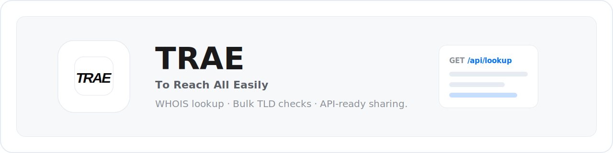

<p align="center">
  
</p>

<p align="center">
  <a href="#简体中文"></a>
  <a href="#english"></a>
  <a href="#한국어"></a>
  <a href="#日本語"></a>
</p>

<p align="center">
  
  
  
  
  
  
  
</p>

# To Reach All Easily

[简体中文](#简体中文) | [English](#english) | [한국어](#한국어) | [日本語](#日本語)

## 简体中文

To Reach All Easily 是一个源码公开的域名信息查询界面，支持 WHOIS 查询、批量后缀检测、查询会话、本地历史记录和查询结果分享。

项目使用 React、TypeScript、Vite、Tailwind CSS、Zustand 构建，并提供一个轻量 Node 静态服务，用于托管 `dist/`、处理 SPA fallback，并将同源 `/api/*` 请求代理到默认上游 `https://yisi.yun` 或你自定义的上游服务。

### 功能特性

- 单域名 WHOIS 查询与结构化结果展示。
- 批量 TLD 检测，按通用后缀、国家地区后缀、新后缀和 IDN 后缀分组。
- 本地查询历史和会话式查询导航。
- 内置 API 文档页和可运行请求示例。
- 基于本地 JSON 文件存储的查询结果分享链接。
- PWA 注册与桌面/移动端响应式布局。

### 当前业务能力

当前版本面向域名信息查询和开放 API 接入场景，重点提供：

- 域名 WHOIS 查询结果的结构化展示。
- 批量后缀可用性检测和分组汇总。
- 查询过程进度提示、结果分享和本地历史记录。
- 面向开发者的 API 文档、在线测试和 API Key 申请入口。

### 环境要求

- Node.js 20 或更新版本。
- pnpm 9 或更新版本。
- 如需真实查询结果，需要可用的 WHOIS/API 上游服务。

### 快速开始

```bash
pnpm install
cp .env.example .env.local
pnpm dev
```

打开终端输出的本地 Vite 地址即可访问。

界面可以在没有真实凭据的情况下启动，但实时查询需要配置你自己的上游访问参数。

### API Key 申请

如需使用默认上游 `https://yisi.yun`，请前往 `https://yisi.yun/api-docs` 申请 API Key。获取后将 Key 写入 `.env.local` 的 `UPSTREAM_API_KEY`。

### 环境变量

本地开发时复制 `.env.example` 为 `.env.local`。

| 变量 | 是否必需 | 说明 |
| --- | --- | --- |
| `UPSTREAM_API_ORIGIN` | 可选 | Vite 代理和 `server.mjs` 使用的服务端上游 API 地址，默认 `https://yisi.yun`。 |
| `UPSTREAM_API_KEY` | 取决于上游 | 如果上游需要认证，会作为 `x-api-key` 请求头转发。 |
| `VITE_PUBLIC_API_BASE` | 可选 | API 文档页展示的公开 Base URL，默认 `https://yisi.yun`。 |
| `VITE_API_BASE` | 可选 | 浏览器侧 API Base 覆盖项。留空时使用同源 `/api/*`。 |
| `HOST` | 可选 | `server.mjs` 监听 Host，默认 `127.0.0.1`。 |
| `PORT` | 可选 | `server.mjs` 监听端口，默认 `3002`。 |
| `ONEFOUR_SHARE_TTL_SECONDS` | 可选 | 分享结果有效期，单位秒，默认 7200。 |
| `ONEFOUR_SHARE_STORAGE_DIR` | 可选 | 分享 JSON 文件存储目录，默认 `.onefour-share-data`。 |

不要提交 `.env`、`.env.local`、生产凭据或复制来的服务商密钥。

### 常用命令

```bash
pnpm dev        # 启动 Vite 开发服务器
pnpm check      # TypeScript 类型检查
pnpm lint       # ESLint 检查
pnpm build      # 构建生产资源
pnpm preview    # 预览 Vite 构建产物
pnpm start:prod # 使用 server.mjs 托管 dist
```

### 生产构建

```bash
pnpm install --frozen-lockfile
pnpm build
HOST=127.0.0.1 PORT=3002 node server.mjs
```

`server.mjs` 会托管 `dist/`、处理 SPA fallback 路由，并把同源 `/api/*` 请求代理到 `UPSTREAM_API_ORIGIN`。

### 上游 API 契约

当前界面默认期望上游提供以下路由：

- `GET /api/lookup?query=example.com`
- `GET /api/lookup/stream?query=example.com`
- `GET /api/supported-tlds?status=enabled&limit=10000`
- `POST /api/bulk-dns-check`
- `GET /api/bulk-dns-check/stream?query=example`

如果你的上游响应结构不同，请调整 `src/utils/api.ts`、`serverGateway.js` 和 `src/utils/` 下的展示映射逻辑。

### 项目结构

```text
src/
├── components/   # 布局、查询结果、会话和通用 UI 组件
├── hooks/        # PWA、主题、历史记录和 WHOIS hooks
├── lib/          # 通用工具
├── pages/        # 路由页面
├── store/        # Zustand 状态
├── types/        # TypeScript 类型
└── utils/        # API、存储、格式化和查询辅助逻辑
```

### 安全与贡献

请不要通过公开 GitHub Issues 报告安全问题，详见 `SECURITY.md`。贡献流程见 `CONTRIBUTING.md`。

### 许可证

本项目使用自定义 Source-Available License，详见 `LICENSE`。

- 允许个人、学习、研究、评估和其他非商业用途。
- 商业使用必须事先获得作者书面批准。
- 禁止出售包含本代码、修改版代码或本代码实质部分的软件。

## English

To Reach All Easily is a source-available domain intelligence interface for WHOIS lookup, bulk TLD checks, query sessions, local history, and shareable lookup results.

The app is built with React, TypeScript, Vite, Tailwind CSS, Zustand, and a small Node static server that serves `dist/`, handles SPA fallback, and proxies same-origin `/api/*` requests to the default upstream `https://yisi.yun` or another configurable upstream service.

### Features

- Single-domain WHOIS lookup with structured result cards.
- Bulk TLD availability checks grouped by generic, country-code, new, and IDN suffixes.
- Local query history and session-style query navigation.
- API documentation page with runnable request examples.
- Share links backed by a local JSON file store.
- PWA registration and responsive desktop/mobile layout.

### Current Capabilities

This version focuses on domain intelligence lookup and API access workflows:

- Structured display for domain WHOIS results.
- Bulk suffix availability checks with grouped summaries.
- Query progress feedback, result sharing, and local history.
- Developer-facing API documentation, online testing, and an API Key application entry.

### Requirements

- Node.js 20 or newer.
- pnpm 9 or newer.
- A compatible WHOIS/API upstream if you want live lookup results.

### Quick Start

```bash
pnpm install
cp .env.example .env.local
pnpm dev
```

Open the local Vite URL printed in the terminal.

The UI can start without real credentials, but live lookup requests require your own upstream configuration.

### API Key Application

To use the default upstream `https://yisi.yun`, apply for an API Key at `https://yisi.yun/api-docs`. After receiving the key, set it as `UPSTREAM_API_KEY` in `.env.local`.

### Environment Variables

Copy `.env.example` to `.env.local` for local development.

| Variable | Required | Description |
| --- | --- | --- |
| `UPSTREAM_API_ORIGIN` | Optional | Server-side upstream API origin used by Vite proxy and `server.mjs`; defaults to `https://yisi.yun`. |
| `UPSTREAM_API_KEY` | Depends on upstream | Server-side API key forwarded as `x-api-key` when configured. |
| `VITE_PUBLIC_API_BASE` | Optional | Public base URL displayed in the API docs page; defaults to `https://yisi.yun`. |
| `VITE_API_BASE` | Optional | Browser-side API base override. Leave empty to use same-origin `/api/*`. |
| `HOST` | Optional | Host for `server.mjs`; defaults to `127.0.0.1`. |
| `PORT` | Optional | Port for `server.mjs`; defaults to `3002`. |
| `ONEFOUR_SHARE_TTL_SECONDS` | Optional | Share result lifetime in seconds; defaults to 7200. |
| `ONEFOUR_SHARE_STORAGE_DIR` | Optional | Directory for share JSON files; defaults to `.onefour-share-data`. |

Do not commit `.env`, `.env.local`, production credentials, or copied provider secrets.

### Scripts

```bash
pnpm dev        # Start the Vite development server
pnpm check      # Run TypeScript type checking
pnpm lint       # Run ESLint
pnpm build      # Build production assets
pnpm preview    # Preview the Vite production build
pnpm start:prod # Serve dist with server.mjs
```

### Production Build

```bash
pnpm install --frozen-lockfile
pnpm build
HOST=127.0.0.1 PORT=3002 node server.mjs
```

`server.mjs` serves `dist/`, handles SPA fallback routes, and proxies same-origin `/api/*` requests to `UPSTREAM_API_ORIGIN`.

### Upstream API Contract

The current UI expects these upstream routes:

- `GET /api/lookup?query=example.com`
- `GET /api/lookup/stream?query=example.com`
- `GET /api/supported-tlds?status=enabled&limit=10000`
- `POST /api/bulk-dns-check`
- `GET /api/bulk-dns-check/stream?query=example`

If your upstream uses a different response shape, adapt `src/utils/api.ts`, `serverGateway.js`, and the display mappers under `src/utils/`.

### Project Structure

```text
src/
├── components/   # Layout, query result, session, and common UI components
├── hooks/        # PWA, theme, history, and WHOIS hooks
├── lib/          # Shared utilities
├── pages/        # Route pages
├── store/        # Zustand stores
├── types/        # TypeScript models
└── utils/        # API, storage, formatting, and query helpers
```

### Security And Contributing

Please do not report security issues through public GitHub Issues. See `SECURITY.md`. See `CONTRIBUTING.md` for the contribution workflow.

### License

This project uses a custom Source-Available License. See `LICENSE`.

- Personal, educational, research, evaluation, and other non-commercial use is allowed.
- Commercial use requires prior written approval from the author.
- Selling software that contains this code, modified code, or a substantial portion of this code is prohibited.

## 한국어

To Reach All Easily는 WHOIS 조회, 대량 TLD 확인, 조회 세션, 로컬 기록, 공유 가능한 조회 결과를 제공하는 소스 공개형 도메인 정보 조회 인터페이스입니다.

이 앱은 React, TypeScript, Vite, Tailwind CSS, Zustand로 만들어졌으며, `dist/`를 제공하고 SPA fallback을 처리하며 동일 출처 `/api/*` 요청을 기본 업스트림 `https://yisi.yun` 또는 사용자가 설정한 업스트림 서비스로 프록시하는 가벼운 Node 정적 서버를 포함합니다.

### 주요 기능

- 단일 도메인 WHOIS 조회와 구조화된 결과 카드.
- 일반, 국가 코드, 신규, IDN 접미사 그룹별 대량 TLD 가용성 확인.
- 로컬 조회 기록과 세션형 조회 탐색.
- 실행 가능한 요청 예제가 포함된 API 문서 페이지.
- 로컬 JSON 파일 저장소를 사용하는 조회 결과 공유 링크.
- PWA 등록과 데스크톱/모바일 반응형 레이아웃.

### 현재 비즈니스 기능

현재 버전은 도메인 정보 조회와 API 연동 흐름에 초점을 맞춥니다.

- 도메인 WHOIS 결과의 구조화된 표시.
- 그룹별 요약을 포함한 대량 접미사 가용성 확인.
- 조회 진행 상태, 결과 공유, 로컬 기록.
- 개발자를 위한 API 문서, 온라인 테스트, API Key 신청 경로.

### 요구 사항

- Node.js 20 이상.
- pnpm 9 이상.
- 실제 조회 결과가 필요하다면 호환되는 WHOIS/API 업스트림 서비스.

### 빠른 시작

```bash
pnpm install
cp .env.example .env.local
pnpm dev
```

터미널에 출력되는 로컬 Vite URL을 열면 됩니다.

UI는 실제 자격 증명 없이도 시작할 수 있지만, 실시간 조회에는 사용자 본인의 업스트림 설정이 필요합니다.

### API Key 신청

기본 업스트림 `https://yisi.yun`을 사용하려면 `https://yisi.yun/api-docs`에서 API Key를 신청하세요. 발급받은 Key는 `.env.local`의 `UPSTREAM_API_KEY`에 설정하세요.

### 환경 변수

로컬 개발에서는 `.env.example`을 `.env.local`로 복사하세요.

| 변수 | 필수 여부 | 설명 |
| --- | --- | --- |
| `UPSTREAM_API_ORIGIN` | 선택 | Vite 프록시와 `server.mjs`가 사용하는 서버 측 업스트림 API 주소입니다. 기본값은 `https://yisi.yun`입니다. |
| `UPSTREAM_API_KEY` | 업스트림에 따라 다름 | 설정된 경우 `x-api-key` 요청 헤더로 업스트림에 전달됩니다. |
| `VITE_PUBLIC_API_BASE` | 선택 | API 문서 페이지에 표시되는 공개 Base URL입니다. 기본값은 `https://yisi.yun`입니다. |
| `VITE_API_BASE` | 선택 | 브라우저 측 API Base 재정의 값입니다. 비워 두면 동일 출처 `/api/*`를 사용합니다. |
| `HOST` | 선택 | `server.mjs`가 바인딩할 Host입니다. 기본값은 `127.0.0.1`입니다. |
| `PORT` | 선택 | `server.mjs` 포트입니다. 기본값은 `3002`입니다. |
| `ONEFOUR_SHARE_TTL_SECONDS` | 선택 | 공유 결과 유지 시간(초)입니다. 기본값은 7200입니다. |
| `ONEFOUR_SHARE_STORAGE_DIR` | 선택 | 공유 JSON 파일 저장 디렉터리입니다. 기본값은 `.onefour-share-data`입니다. |

`.env`, `.env.local`, 운영 자격 증명 또는 복사한 제공업체 비밀값을 커밋하지 마세요.

### 스크립트

```bash
pnpm dev        # Vite 개발 서버 시작
pnpm check      # TypeScript 타입 검사
pnpm lint       # ESLint 실행
pnpm build      # 운영 빌드 생성
pnpm preview    # Vite 빌드 결과 미리보기
pnpm start:prod # server.mjs로 dist 제공
```

### 운영 빌드

```bash
pnpm install --frozen-lockfile
pnpm build
HOST=127.0.0.1 PORT=3002 node server.mjs
```

`server.mjs`는 `dist/`를 제공하고, SPA fallback 라우트를 처리하며, 동일 출처 `/api/*` 요청을 `UPSTREAM_API_ORIGIN`으로 프록시합니다.

### 업스트림 API 계약

현재 UI는 업스트림에 다음 라우트가 있다고 가정합니다.

- `GET /api/lookup?query=example.com`
- `GET /api/lookup/stream?query=example.com`
- `GET /api/supported-tlds?status=enabled&limit=10000`
- `POST /api/bulk-dns-check`
- `GET /api/bulk-dns-check/stream?query=example`

업스트림 응답 구조가 다르다면 `src/utils/api.ts`, `serverGateway.js`, `src/utils/` 아래의 표시 매핑 로직을 조정하세요.

### 프로젝트 구조

```text
src/
├── components/   # 레이아웃, 조회 결과, 세션, 공통 UI 컴포넌트
├── hooks/        # PWA, 테마, 기록, WHOIS hooks
├── lib/          # 공통 유틸리티
├── pages/        # 라우트 페이지
├── store/        # Zustand 스토어
├── types/        # TypeScript 모델
└── utils/        # API, 저장소, 포맷팅, 조회 도우미
```

### 보안 및 기여

보안 문제는 공개 GitHub Issues로 보고하지 마세요. `SECURITY.md`를 참고하세요. 기여 절차는 `CONTRIBUTING.md`를 참고하세요.

### 라이선스

이 프로젝트는 사용자 지정 Source-Available License를 사용합니다. `LICENSE`를 참고하세요.

- 개인, 교육, 연구, 평가 및 기타 비상업적 사용은 허용됩니다.
- 상업적 사용은 저자의 사전 서면 승인이 필요합니다.
- 이 코드, 수정된 코드 또는 이 코드의 실질적인 부분을 포함하는 소프트웨어를 판매하는 것은 금지됩니다.

## 日本語

To Reach All Easily は、WHOIS 検索、一括 TLD チェック、検索セッション、ローカル履歴、共有可能な検索結果を提供するソース公開型のドメイン情報検索インターフェースです。

このアプリは React、TypeScript、Vite、Tailwind CSS、Zustand で構築されています。また、`dist/` の配信、SPA fallback の処理、同一オリジンの `/api/*` リクエストを既定の上流 `https://yisi.yun` または任意の上流サービスへプロキシする軽量な Node 静的サーバーを含みます。

### 主な機能

- 単一ドメインの WHOIS 検索と構造化された結果カード。
- 汎用、国コード、新 gTLD、IDN サフィックスごとの一括 TLD 可用性チェック。
- ローカル検索履歴とセッション型の検索ナビゲーション。
- 実行可能なリクエスト例を含む API ドキュメントページ。
- ローカル JSON ファイルストアによる検索結果共有リンク。
- PWA 登録とデスクトップ/モバイル対応のレスポンシブレイアウト。

### 現在の事業機能

現在のバージョンは、ドメイン情報検索と API 連携ワークフローに重点を置いています。

- ドメイン WHOIS 結果の構造化表示。
- グループ別サマリー付きの一括サフィックス可用性チェック。
- 検索進行状況、結果共有、ローカル履歴。
- 開発者向け API ドキュメント、オンラインテスト、API Key 申請導線。

### 要件

- Node.js 20 以上。
- pnpm 9 以上。
- 実際の検索結果が必要な場合は、互換性のある WHOIS/API 上流サービス。

### クイックスタート

```bash
pnpm install
cp .env.example .env.local
pnpm dev
```

ターミナルに表示されるローカル Vite URL を開いてください。

UI は実際の認証情報がなくても起動できますが、ライブ検索には独自の上流設定が必要です。

### API Key 申請

既定の上流 `https://yisi.yun` を使用する場合は、`https://yisi.yun/api-docs` で API Key を申請してください。取得した Key は `.env.local` の `UPSTREAM_API_KEY` に設定してください。

### 環境変数

ローカル開発では `.env.example` を `.env.local` にコピーしてください。

| 変数 | 必須 | 説明 |
| --- | --- | --- |
| `UPSTREAM_API_ORIGIN` | 任意 | Vite proxy と `server.mjs` が使用するサーバー側の上流 API オリジンです。既定値は `https://yisi.yun` です。 |
| `UPSTREAM_API_KEY` | 上流次第 | 設定されている場合、`x-api-key` リクエストヘッダーとして上流へ転送されます。 |
| `VITE_PUBLIC_API_BASE` | 任意 | API ドキュメントページに表示される公開 Base URL です。既定値は `https://yisi.yun` です。 |
| `VITE_API_BASE` | 任意 | ブラウザー側 API Base の上書き値です。空の場合は同一オリジンの `/api/*` を使用します。 |
| `HOST` | 任意 | `server.mjs` の Host です。既定値は `127.0.0.1` です。 |
| `PORT` | 任意 | `server.mjs` のポートです。既定値は `3002` です。 |
| `ONEFOUR_SHARE_TTL_SECONDS` | 任意 | 共有結果の有効期限(秒)です。既定値は 7200 です。 |
| `ONEFOUR_SHARE_STORAGE_DIR` | 任意 | 共有 JSON ファイルの保存ディレクトリです。既定値は `.onefour-share-data` です。 |

`.env`、`.env.local`、本番認証情報、コピーしたプロバイダーのシークレットはコミットしないでください。

### スクリプト

```bash
pnpm dev        # Vite 開発サーバーを起動
pnpm check      # TypeScript 型チェックを実行
pnpm lint       # ESLint を実行
pnpm build      # 本番ビルドを作成
pnpm preview    # Vite ビルド結果をプレビュー
pnpm start:prod # server.mjs で dist を配信
```

### 本番ビルド

```bash
pnpm install --frozen-lockfile
pnpm build
HOST=127.0.0.1 PORT=3002 node server.mjs
```

`server.mjs` は `dist/` を配信し、SPA fallback ルートを処理し、同一オリジンの `/api/*` リクエストを `UPSTREAM_API_ORIGIN` へプロキシします。

### 上流 API 契約

現在の UI は、上流に次のルートがあることを想定しています。

- `GET /api/lookup?query=example.com`
- `GET /api/lookup/stream?query=example.com`
- `GET /api/supported-tlds?status=enabled&limit=10000`
- `POST /api/bulk-dns-check`
- `GET /api/bulk-dns-check/stream?query=example`

上流のレスポンス形式が異なる場合は、`src/utils/api.ts`、`serverGateway.js`、`src/utils/` 配下の表示マッピングを調整してください。

### プロジェクト構成

```text
src/
├── components/   # レイアウト、検索結果、セッション、共通 UI コンポーネント
├── hooks/        # PWA、テーマ、履歴、WHOIS hooks
├── lib/          # 共通ユーティリティ
├── pages/        # ルートページ
├── store/        # Zustand ストア
├── types/        # TypeScript モデル
└── utils/        # API、ストレージ、整形、検索補助ロジック
```

### セキュリティとコントリビューション

セキュリティ問題を公開 GitHub Issues で報告しないでください。`SECURITY.md` を参照してください。貢献手順は `CONTRIBUTING.md` を参照してください。

### ライセンス

このプロジェクトはカスタム Source-Available License を使用しています。`LICENSE` を参照してください。

- 個人、教育、研究、評価、その他の非商用利用は許可されます。
- 商用利用には作者の事前の書面による承認が必要です。
- このコード、変更版コード、またはこのコードの実質的な部分を含むソフトウェアを販売することは禁止されています。
